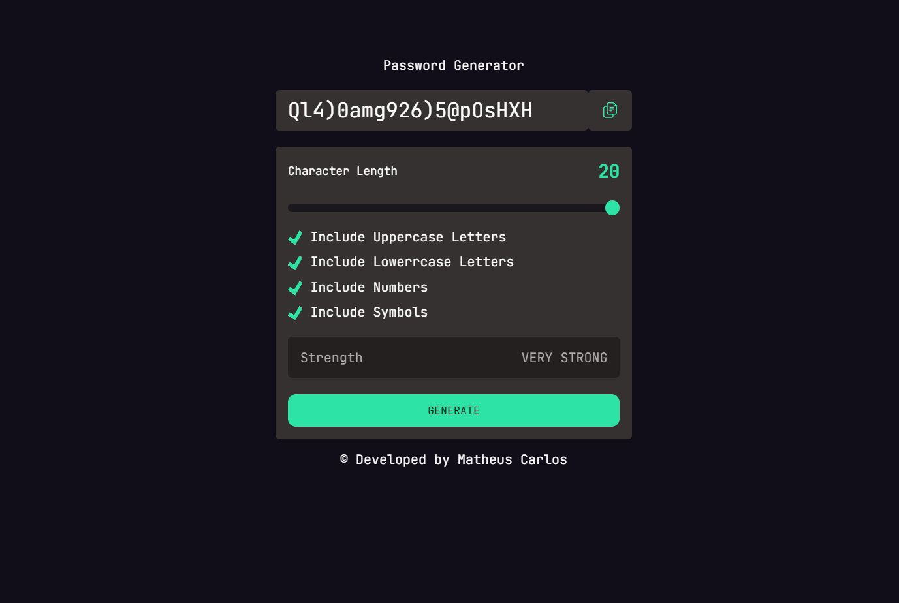

<h1 align="center"> Password Generator </h1>

  Aplicação web para gerar senhas, onde você pode incluir letras maiúsculas, minúsculas, números e símbolos, assim como o tamanho da sua senha.      

  <a href="#-tecnologias">Tecnologias</a>&nbsp;&nbsp;&nbsp;|&nbsp;&nbsp;&nbsp;
  <a href="#-projeto">Projeto</a>&nbsp;&nbsp;&nbsp;|&nbsp;&nbsp;&nbsp;
  <a href="#memo-licença">Licença</a>

 

  

## 🚀 Tecnologias

Esse projeto foi desenvolvido com as seguintes tecnologias:

- HTML e CSS
- JavaScript e JSON
- [Node e NPM](https://nodejs.org/)
- [Vite](https://vitejs.dev/)

## 💻 Projeto

O password Generator é um projeto de nível intermediário desenvolvido para fins de estudo/prática sobre as tecnologias citadas acima.

- [Confira a aplicação ONLINE aqui.](https://pass-generator-umber.vercel.app/)

## :memo: Licença

Desenvolvido por Matheus Carlos :wave:

---
